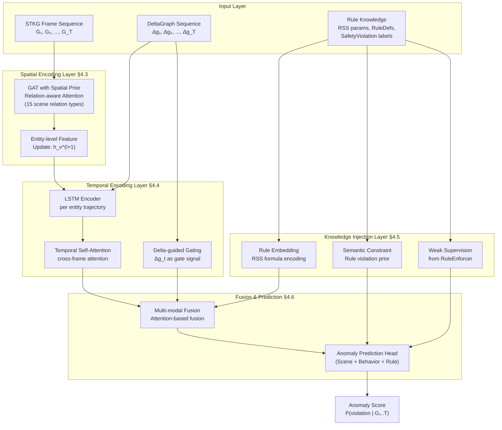

# 时空动态知识图谱 — 大论文与投稿论文全规划文档

> 生成日期：2026-07-23
> 基于 SpatioTemporalKG 代码库 v0.0.1 / 设计文档 v3

---

## 目录

1. 大论文整体框架（融合版）
2. 第 4 章核心技术：K-HSTGAN 架构详细设计
3. 实验方案（RQ1-RQ5 完整版）
4. 投稿论文计划
5. 关键模块实现路径图

---

## 一、大论文整体框架

### 论文题目（中/英）

> 面向自动驾驶安全验证的时空动态知识图谱构建与图神经网络异常检测方法研究
> *Spatio-Temporal Knowledge Graph Construction and Graph Neural Network-based Anomaly Detection for Autonomous Driving Safety Validation*

### 三大创新点

| 编号 | 名称 | 对应大论文章节 | 关键词 |
|------|------|---------------|--------|
| **点①** | 面向驾驶安全的 4 层 STKG 本体与流式构建系统 | 第 3 章 | 本体设计、增量更新、流式采集 |
| **点②** | 知识引导的层次化时空图注意力网络（K-HSTGAN） | 第 4 章 | GNN+LSTM+注意力+知识注入 |
| **点③** | 知识引导的符号-神经双向闭环融合框架（KS-NBCF） | 第 5 章 | 特征层注入、双向闭环、D-S 证据融合、冲突消解 |

---

### 详细目录

#### 第 1 章 绪论

| 序号 | 内容 | 写作要点 |
|------|------|---------|
| 1.1 | 研究背景与意义 | 自动驾驶安全验证挑战；知识图谱在安全验证中的独特价值；时空动态建模的必要性 |
| 1.2 | 国内外研究现状 | 三方向简短综述：TKG 构建、TKG 推理、驾驶安全验证（详见第 2 章） |
| 1.3 | 研究内容与创新点 | 三大创新点逐一阐述 |
| 1.4 | 论文结构安排 | 章节组织图 |

#### 第 2 章 相关工作

| 序号 | 内容 | 核心引文 | 回应你的工作 |
|------|------|---------|------------|
| 2.1 | 时序/时空知识图谱构建 | Plamper et al. (2025, arXiv) STKG 综述; Hao et al. (2025, Neurocomputing) | 现有方法缺乏面向驾驶场景的端到端构建框架 |
| 2.2 | 时序知识图谱表示学习与推理 | TNTComplEx (NeurIPS'20), RE-GCN (AAAI'21), xERTE (ICLR'21), TeRo (COLING'20), DE-SimplE (AAAI'20), ChronoR (EMNLP'21) | 面向 ICEWS/GDELT 文本数据，不适用于物理传感驾驶场景 |
| 2.3 | 自动驾驶安全验证方法 | RSS 模型 (Shalev-Shwartz et al. 2017), ScenarioRunner, CarDreamer | 纯符号或纯数据驱动，缺乏融合 |
| 2.4 | 图神经网络异常检测 | GDN (AAAI'21), MTAD-GAT (ICDM'20), AnomalyDAE (2020) | 面向多元时间序列，未利用结构化 KG |
| 2.5 | 知识引导的图神经网络 | KGN, GNN+Rule, Neuro-Symbolic | 知识注入的优势与挑战 |

#### 第 3 章 时空动态知识图谱构建（创新点①）

> **对应代码**：`stk/ontology/`, `stk/scenario/`, `stk/behavior/`, `stk/rules/`, `stk/dynamic/`, `stk/storage/`, `scripts/long_run/`
> **对应文档**：`docs/v3_paragraphs.txt`

| 序号 | 内容 | 对应代码 | 对应文档 § |
|------|------|---------|-----------|
| 3.1 | 问题定义与形式化 | `ontology/types.py`（14 种实体枚举）; `ontology/entity.py`（BaseEntity）; `ontology/relation.py`（BaseRelation）; `ontology/temporal_triple.py`（τ := (s,p,o,t)）; `ontology/axioms.py`（7 条核心公理） | §1.7–1.11 |
| | — 本体形式化 O := (E, A, R, T, P) | | |
| | — 时态三元组 τ := (s, p, o, t) | | |
| | — 节点生命周期模型（帧级版本化 + 显式生命周期标记） | `ontology/lifecycle.py` | |
| 3.2 | 四层本体总体设计 | 三层叠加 + 横向动态机制 | §1.4 |
| | — 场景层 → 行为层 → 规则层（递进抽象） | | |
| | — 横向机制：动态更新（四类更新动作） | | |
| | — 节点+边双轨表达对齐原则 | | |
| 3.3 | 场景层：实体与空间关系提取 | `scenario/nodes.py`（VehicleEntity 等 6 类节点, 18+ 字段）; `scenario/spatial.py`（compute_in_lane, compute_ahead_of, compute_beside 等纯函数）; `scenario/relations.py`（15 种场景关系）; `scenario/snapshot_builder.py`（FrameData + build_snapshot）; `extraction/`（6 类 CARLA 提取器） | §2.2–2.11 |
| | — 6 类节点（Vehicle/Pedestrian/TrafficLight/RoadElement/EnvSnapshot/ScenarioSnapshot） | | |
| | — 15 种空间关系（拓扑 7 + 空间 3 + 控制 1 + 帧聚合 4） | | |
| | — 几何确定性：每条关系由 CARLA 真值直接计算 | | |
| 3.4 | 行为层：行为检测与防抖 | `behavior/detectors.py`（11 个检测函数）; `behavior/generator.py`（BehaviorRelationGenerator）; `behavior/debouncer.py`（RelationDebouncer）; `behavior/nodes.py`（ManeuverNode + InteractionEvent）; `behavior/relations.py`（13 种行为关系）; `behavior/manifest.py`（跨层桥接 manifestsAs/actor/src/dst） | §3.1–3.7 |
| | — 11 种行为检测器（following, approaching, yielding_to, overtaking 等） | | |
| | — ManeuverNode（单实体持续状态）+ InteractionEvent（多实体交互） | | |
| | — 防抖状态机（持续帧数阈值，防止闪烁） | | |
| | — 节点+边双轨 + manifestsAs 桥接 | | |
| 3.5 | 规则层：RSS 与交通法规推理 | `rules/rss/model.py`（RSS 三算子：纵向安全距离/横向安全距离/责任归因）; `rules/traffic/rules.py`（14 条交规 R1-R18 检测器）; `rules/generator.py`（RuleEnforcer，含跨帧状态保持）; `rules/nodes.py`（SafetyViolation/ResponsibilityAssignment）; `rules/relations.py`（violates/definedBy/supportedByEvidence/responsibleFor/causedBy）; `dynamic/event_injector.py`（反向插入） | §4.7–4.18 |
| | — RSS 子层：d_min 公式、复合判断、NoProperResponse、责任归因 | | |
| | — 交规子层：R1 行人优先 ~ R18 不按导向车道 | | |
| | — SafetyViolation 节点 + violates 边 + Evidence 链（双轨表达） | | |
| | — ResponsibilityAssignment 责任归因 | | |
| 3.6 | 动态更新机制 | `dynamic/diff.py`（DeltaGraph + DiffSet + compute_delta）; `dynamic/incremental_updater.py`（IncrementalEngine.process_frame）; `dynamic/version.py`（VersionManager + AttrVersion）; `dynamic/time_window.py`（TimeWindowAggregator + SummaryEvent）; `dynamic/snapshot_store.py`（SnapshotStore） | §5.1–5.5 |
| | — Δg_t := (delta_entities, delta_attrs, delta_relations, rule_events) | | |
| | — 四类更新动作：实体级/属性级/关系级/规则事件 | | |
| | — 帧跳检测（frame_gap > 1 → baseline 重置） | | |
| | — 属性版本化：AttrVersion (value, valid_from, valid_to) | | |
| | — 时间窗口聚合：滑动窗口分析复杂行为（overtaking 需跨 30 帧） | | |
| 3.7 | 流式长时采集与存储 | `scripts/long_run/collect.py`（分块采集 2000 帧/chunk）; `scripts/long_run/anomaly_scheduler.py`（7 种异常泊松调度）; `scripts/long_run/pipeline.py`（跨 chunk 编排 + checkpoint 恢复 + shard 输出）; `scripts/long_run/build_anomaly_dataset.py`（异常数据集构建）; `stk/storage/`（Neo4j 批量写入 + JSON 序列化 + GraphImporter） | — |
| | — 分块采集跨 chunk 状态持续 | | |
| | — Checkpoint 恢复 + 流式写盘 | | |
| | — 7 种异常类型（急刹/急停/紧急变道/路口不让行/逆向/行人横穿/视线遮挡） | | |
| | — Neo4j Schema + 批量 MERGE + 索引 | | |
| 3.8 | 实验设计与场景库 | `scenario/scenario_library.py`（14 个预置场景：A 基线 3 + B 单点异常 4 + C 多车冲突 3 + D 跨层联动 4）; `config/`（YAML 配置：pipeline/rss_rules/traffic_rules/ontology/ego_centric/neo4j）; `scripts/pipeline/cross_validate.py`（3 张地图交叉验证） | §2.14 |
| 3.9 | 本章小结 | — | — |

#### 第 4 章 知识引导的层次化时空图注意力网络 K-HSTGAN（创新点②）

> 本章是后续需要代码实现的核心章节。详见第 2 节的具体架构设计。

| 序号 | 内容 | 实现阶段 |
|------|------|---------|
| 4.1 | 问题映射：将异常检测建模为 STKG 上的时序预测 | 理论分析 |
| 4.2 | 总体架构：K-HSTGAN 三层设计 | 架构设计 |
| 4.3 | 空间编码层：关系感知图注意力（GAT on G_t） | 代码实现 |
| 4.4 | 时序编码层：差分驱动的层次化 LSTM-Attenion | 代码实现 |
| 4.5 | 知识注入层：规则知识编码与注入 | 代码实现 |
| 4.6 | 多模态融合与异常预测 | 代码实现 |
| 4.7 | 训练策略与损失函数 | 代码实现 |
| 4.8 | 本章小结 | — |

#### 第 5 章 知识引导的符号-神经双向闭环融合框架 KS-NBCF（创新点③）

> **对应代码**：`stk/rules/`（规则引擎）+ `stk/gnn/`（K-HSTGAN）+ 新建 `stk/fusion/`（融合框架核心）
> **设计原则**：融合不是简单"规则 + GNN"的串联或并联叠加，而是**特征层注入 → 双向闭环训练 → 推理时证据理论融合 → 冲突消解**的完整方法论

| 序号 | 内容 | 数学/算法呈现 | 对应代码 |
|------|------|-------------|---------|
| 5.1 | 融合的挑战与设计动机 | 痛点分析：单向融合 vs 双向闭环 vs 冲突消解的层次差异 | — |
| 5.2 | KS-NBCF 框架总体架构 | 三子模块 + 形式化定义 $\mathcal{F}_{\text{NBCF}} := (\phi_{\text{feat}}, \phi_{\text{loop}}, \phi_{\text{fuse}})$ | `stk/fusion/framework.py` |
| 5.3 | 子模块①：特征层规则先验注入 $\phi_{\text{feat}}$ | $h_v^{(0)} = [x_v ; \kappa_{\text{rss}}(v) ; \kappa_{\text{rule}}(v)]$ | `stk/fusion/feature_injector.py` |
| 5.4 | 子模块②：训练-推理三阶段双向闭环 $\phi_{\text{loop}}$ | 训练前弱监督 / 训练中反馈 / 推理时模板更新 | `stk/fusion/loop.py` |
| 5.5 | 子模块③：D-S 证据理论融合与冲突消解 $\phi_{\text{fuse}}$ | 质量函数构造 + Dempster 组合规则 + KG 证据链回溯仲裁 | `stk/fusion/dempster_shafer.py`, `stk/fusion/conflict_resolver.py` |
| 5.6 | 完整算法伪代码与复杂度分析 | 算法 1 主流程 / 算法 2 冲突消解 / 复杂度 $O(V+E+K)$ | `stk/fusion/algorithm.py` |
| 5.7 | 本章小结 | 与现有融合方法对比（见 5.7 节表 11） | — |

#### 第 6 章 实验与结果分析

详见第三节实验方案。

| 序号 | 内容 | 对应实验 |
|------|------|---------|
| 6.1 | 实验设置 | 硬件/软件/数据集 |
| 6.2 | RQ1: STKG 构建质量评测 | 场景层+行为层+规则层准确率 |
| 6.3 | RQ2: 流式处理性能评测 | 吞吐/延迟/内存/扩展性 |
| 6.4 | RQ3: K-HSTGAN 异常检测效果评测 | 与 baselines 对比 |
| 6.5 | RQ4: 消融实验（含 KS-NBCF 三子模块消融） | 架构/系统/融合 三层消融 |
| 6.6 | RQ5: 融合框架效果与冲突消解案例研究 | 融合 vs 单一 + 冲突消解 + Case Study |

#### 第 7 章 总结与展望

| 序号 | 内容 |
|------|------|
| 7.1 | 工作总结 |
| 7.2 | 不足与展望 |

---

## 二、第 4 章核心技术：K-HSTGAN 架构详细设计

### 2.1 设计理念

> 为什么叫 K-HSTGAN？
> - **K**（Knowledge）：规则知识的显式注入
> - **H**（Hierarchical）：层次化处理——逐实体 → 逐帧 → 逐窗口
> - **ST**（Spatio-Temporal）：同时建模空间拓扑与时间演化
> - **GAT**（Graph Attention Network）：图注意力为核心的骨架
> - **N**（Network）

架构图（Mermaid）：



### 2.2 各子模块详细设计

#### 2.2.1 输入层：从 STKG 导出模型输入

| 输入 | 来源 | 维度 | 描述 |
|------|------|------|------|
| 节点特征矩阵 X_t | `VehicleEntity.attrs` | N×F (F=18+) | 位置、速度、朝向、油门、刹车等 |
| 邻接矩阵 A_t | 场景层 15 种空间关系 | N×N×(R_scene+1) | in_lane/ahead_of/beside 等 |
| 行为关系张量 B_t | 行为层 13 种行为关系 | N×N×(R_behavior+1) | following/approaching 等 |
| 差分输入 ΔX_t, ΔA_t | `DeltaGraph` | 同上 × 差分 | 增量变化，减少冗余计算 |
| 额外节点特征 | Lane/Road/Junction 属性 | M×F_road | 静态拓扑信息 |
| 环境特征 | EnvSnapshot | 1×F_env | 天气、能见度、时间等 |

> **代码导出口**：`stk/dynamic/diff.py` → DeltaGraph + `stk/storage/serializer.py` → 节点/边统计表
> 在 `stk/gnn/exporter.py`（新建）中实现 `STKG_to_PyG(frames) -> List[Data]`

#### 2.2.2 空间编码层 §4.3：关系感知图注意力

> **核心思想**：场景层的 15 种空间关系不是平等的——"同一车道跟车"的关注权应不同于"相邻车道并排"。

**传统的 GAT** 对所有邻居用统一注意力，但我们的场景中有 15 种 `SceneRelationType`：

```
e_ij^(l) = LeakyReLU(a^T [W h_i || W h_j])
α_ij = softmax_j(e_ij)
```

**改进公式（空间先验注意力）：**

```
e_ij^(l) = LeakyReLU(a^T [W h_i || W h_j || W_r r_ij])
```

其中 `r_ij` 是场景关系类型嵌入（15 种 SceneRelationType × d_r 维），通过 `nn.Embedding` 学习。

**关系类型重要性先验权重**（来自场景层）：

| 关系 | 对异常检测的重要性 | 说明 |
|------|------------------|------|
| `in_lane` | 高 | 车道定位，判断是否偏离 |
| `ahead_of` | 高 | 跟车危险判断 |
| `beside` | 中高 | 并道/侧碰危险 |
| `nearby_pedestrian` | 高 | 行人碰撞风险 |
| `controlled_by` | 中 | 信号灯关联 |
| `in_junction` | 中 | 路口冲突 |

这些先验权重可以作为 Embedding 的初始化 bias，加快收敛。

**多头注意力**：

```
h_i' = ||_{k=1..K} σ(∑_{j∈N_i} α_ij^k W^k h_j)
```

**对应代码**：
- `stk/scenario/spatial.py`：空间关系计算函数（纯函数）
- `stk/ontology/types.py`：`SceneRelationType` 枚举（15 种）
- 新建 `stk/gnn/spatial_encoder.py`：关系感知 GAT 实现

#### 2.2.3 时序编码层 §4.4：差分驱动的层次化 LSTM-Attention

> **核心思想**：STKG 天然提供 delta 信息，时间窗口是层次化的（帧级 → 行为级 → 场景级）。

**三层架构**：

```
帧级编码（单帧内）：
  LSTM_cell: h_t_frame = LSTM(h_t_entity, h_{t-1}_frame)
  
行为级编码（行为窗口内）：
  利用行为层的 InteractionEvent 起止时间做窗口切分
  h_t_behavior = Attention({h_frame | frame ∈ [start, end]})
  
场景级编码（全局时序）：
  h_t_scene = Transformer(h_t_frame)
```

**差分引导的门控机制**：

Δg_t 中的 `delta_entities`（实体进入/离开）和 `delta_attrs`（属性变化）可作为 LSTM 门控信号：

```
Δ_emb = Embedding(Δg_t.delta_entities, Δg_t.delta_attrs)
gate = σ(W_g · [h_{t-1}, h_t, Δ_emb])
h_t_gated = gate ⊙ h_t_frame + (1 - gate) ⊙ h_{t-1}
```

这样做的好处：
- Δg_t 为空帧 → gate ≈ 0，状态无变化，**减少计算量**
- Δg_t 有实体进出 → gate ≈ 1，状态充分更新
- **体现增量引擎的優勢**

**时间自注意力**（跨帧对比）：

```
α_t = softmax( (Q · K^T) / √d )
其中 Q = h_t_scene · W_Q, K = {h_{1..T}_scene} · W_K
```

**对应代码**：
- `stk/dynamic/diff.py`：`DeltaGraph` 结构（delta_entities, delta_attrs）
- `stk/dynamic/incremental_updater.py`：`IncrementalEngine` 的帧处理
- `stk/dynamic/time_window.py`：`TimeWindowAggregator`
- `stk/behavior/nodes.py`：`InteractionEvent`（帧起止时间）
- 新建 `stk/gnn/temporal_encoder.py`：层次化 LSTM-Attention

#### 2.2.4 知识注入层 §4.5：规则知识编码与注入

> **核心思想**：规则引擎已经编码了大量交规知识和 RSS 物理公式——K-HSTGAN 要"吃"这些知识，不是从零学习。

**三种知识注入方式**：

**方式一：规则语义嵌入**

RSS 参数（`DEFAULT_RSS_PARAMS`）、14 条交规的触发条件编码为向量：

```python
# RSS 参数 → 知识向量 (7维)
k_rss = [
    rho, a_max_accel, a_min_brake_long, a_brake_long,
    mu, a_min_brake_lat, a_brake_lat
]
# Rule定义的编码 (14维 one-hot / 14×d embedding)
k_rule = Embedding(14, d_rule)
```

注入位置：**GAT 注意力计算**，作为偏置项 bias attention towards 规则关注的区域。

**方式二：语义约束层**

RSS 安全距离公式提供物理约束：

```
d_min = max(0, v_A·ρ + 0.5·a_max·ρ² + (v_A+a_max·ρ)²/(2·a_min) - v_B²/(2·a_brake))
```

将实际距离 d_actual 与 d_min 的差异作为 **先验特征** 拼接到检测头输入：

```
f_rss = d_actual - d_min(ego, front_vehicle)  # 负值表示危险
```

**方式三：弱监督标签**

`RuleEnforcer` 输出的 SafetyViolation 节点作为弱监督标签训练 GNN：

- 正样本：SafetyViolation 发生的帧
- 负样本：规则未触发的帧
- 规则引擎的 Severity 可以作为标签置信度权重

**对应代码**：
- `stk/rules/rss/model.py`：`DEFAULT_RSS_PARAMS`, `compute_dmin_long`
- `stk/rules/traffic/rules.py`：14 条交规检测器
- `stk/rules/generator.py`：`RuleEnforcer.enforce()` 返回 SafetyViolation 列表
- `stk/rules/nodes.py`：`SafetyViolation`, `RuleDefinition`
- 新建 `stk/gnn/knowledge_injector.py`

#### 2.2.5 多模态融合与异常预测 §4.6

> **核心思想**：异常可能发生在场景层（空间异常）、行为层（行为异常）、规则层（违规），三个信号要融合。

```
# 三通道特征
f_scene = W_scene · h_t_scene          # 场景层异常信号
f_behavior = W_behavior · h_t_behavior  # 行为层异常信号
f_knowledge = W_knowledge · k_rule      # 规则知识信号

# 注意力融合
β_scene, β_behavior, β_knowledge = Softmax(f_scene, f_behavior, f_knowledge)
f_fused = β_scene · f_scene + β_behavior · f_behavior + β_knowledge · f_knowledge

# 异常预测 (三任务)
p_scene = σ(Linear_scene(f_fused))      # 场景异常概率
p_behavior = σ(Linear_behavior(f_fused)) # 行为异常概率
p_rule = σ(Linear_rule(f_fused))         # 规则触发概率

# 加权融合异常分数
anomaly_score = λ₁·p_scene + λ₂·p_behavior + λ₃·p_rule
```

**异常类型输出**（7 + 14 + 3 = 24 类）：

| 层级 | 异常类型 | 来源 |
|------|---------|------|
| 场景层 | 偏离车道、行人碰撞风险等 3 种 | 空间异常 |
| 行为层 | 异常跟车、急变道、超速接近等 7 种 | 行为异常 |
| 规则层 | R1-R18 + RSS 违规共 14 种（对齐规则引擎分类） | 规则异常 |

**多任务损失函数**：

```
L = L_bce(p_anomaly, y_anomaly)    # 二分类主任务
  + γ₁·L_bce(p_scene, y_scene)     # 场景层辅助任务
  + γ₂·L_bce(p_behavior, y_behavior) # 行为层辅助任务
  + γ₃·L_bce(p_rule, y_rule)       # 规则层辅助任务
  + γ₄·L_contrastive(τ)            # 对比学习：异常帧 vs 正常帧
```

其中 y_scene / y_behavior / y_rule 的 GT 来自：
- 规则引擎输出的 SafetyViolation → y_rule
- 异常注入的类型 → y_scene, y_behavior 可部分映射

**对应代码**：
- 新建 `stk/gnn/fusion_head.py`

### 2.3 K-HSTGAN 与现有方法的对比创新点

| 创新维度 | RE-GCN (AAAI'21) | GDN (AAAI'21) | 你的 K-HSTGAN |
|----------|------------------|---------------|---------------|
| 图构建 | 文本三元组 | 传感器相关性 | 驾驶语义 STKG（4层本体） |
| 时间建模 | GRU | 纯时序 | LSTM + 差分门控 + 自注意力三层 |
| 空间注意力 | 关系感知 GCN | 结构学习 | 空间先验 GAT（15 种关系加权） |
| 知识注入 | 无 | 无 | RSS 公式 + 交规规则 + 弱监督 |
| 输出 | 链接预测 | 偏差评分 | 三任务（场景/行为/规则）+ 可解释 |
| 可解释性 | 无 | 无 | 通过 STKG 证据链回溯 |

---

## 三、第 5 章核心技术：KS-NBCF 融合框架详细设计

### 3.1 设计理念：为什么双向闭环 + 证据理论？

| 融合层次 | 常见做法 | 问题 | KS-NBCF 方案 |
|---------|---------|------|-------------|
| **决策层** | 规则→过滤 GNN 输出 | 规则先验未进入网络学习，GNN 从零学规则 | **特征层注入**：规则先验以连续值进入 GNN 初始特征 |
| **训练时** | 规则仅做评测标签 | 规则与 GNN 无交互 | **三阶段双向闭环**：规则→初始权重→GNN→反馈调整规则→规则修正 |
| **推理时** | 简单 ensemble / voting | 规则与 GNN 冲突时无仲裁 | **D-S 证据理论**：mass 函数 + Dempster 组合 + 冲突系数 → KG 证据链路径回溯仲裁 |
| **可解释性** | 规则提供"因为所以" | 规则与 GNN 不一致时，审稿人不信任 | 冲突消解的过程本身就是一个**完整的解释** |

### 3.2 KS-NBCF 总体架构

```
                        ┌──────────────────────────────────────┐
                        │         KS-NBCF 框架总体架构           │
                        └──────────────────────────────────────┘

训练前（阶段 I）:
  规则引擎 → SafetyViolation 标签 → K-HSTGAN 弱监督初始训练

训练中（阶段 II, 每 epoch）:
  K-HSTGAN → GNN 规则置信度概率
       ↓
  规则引擎输出 → 与概率对比 → 不一致样本加入反馈队列
       ↓
  规则置信度调整（RSS 参数重学习 / 规则触发阈值 Soften）

推理时（阶段 III, 每帧）:
  K-HSTGAN → p_v (GNN 异常概率)
  规则引擎 → s_v (规则触发强度 + 置信度)
       ↓
  D-S 证据融合: m_GNN ⊕ m_rule → m_fused
       ↓
  IF 冲突系数 K > τ:
       └→ 冲突消解: KG 证据链路径回溯 → tie-breaking（仲裁）
       └→ 输出最终判定 + 完整证据链
  ELSE:
       └→ 直接融合判定
```

### 3.3 子模块①：特征层规则先验注入 $\phi_{\text{feat}}$

**核心思想**：规则引擎不是贴在 GNN 外面的后处理模块，而是以连续值先验形式进入 GNN 的初始节点特征，让 GNN 在训练过程中**自动学习规则的重要性权重**。

**步骤一：RSS 残差向量 $\kappa_{\text{rss}}(v)$**

对于每个车辆节点 $v$，计算所有 RSS 检查相对于当前帧该节点的残差：

$$
\kappa_{\text{rss}}(v) = [d_{\min}^{\text{long}} - d_{\text{long}}, \; d_{\min}^{\text{lat}} - d_{\text{lat}}, \; \text{TTC} - \tau_{\text{safe}}, \; v - v_{\text{limit}}, \; \text{brake} - \text{brake}_{\min}]
$$

每个分量的维度：
- 纵向安全距离残差 $d_{\min}^{\text{long}} - d_{\text{long}}$（负值越负越危险）
- 横向安全距离残差 $d_{\min}^{\text{lat}} - d_{\text{lat}}$
- TTC（Time-to-Collision）安全阈值残差
- 速度超出限速量
- 制动踏板阈值残差

**步骤二：交规规则触发强度 $\kappa_{\text{rule}}(v)$**

对于 14 条交规（R1-R18），每条输出标量触发强度：

$$
\kappa_{\text{rule}}^{(i)}(v) = \begin{cases}
\text{severity}_i & \text{if rule } i \text{ triggers on } v \\
0 & \text{otherwise}
\end{cases}
$$

得到 14 维向量 $\kappa_{\text{rule}}(v) = [\kappa_{\text{rule}}^{(1)}, ..., \kappa_{\text{rule}}^{(14)}]$

**步骤三：拼接为初始特征**

$$
h_v^{(0)} = [x_v \; \| \; \kappa_{\text{rss}}(v) \; \| \; \kappa_{\text{rule}}(v)]
$$

其中 $x_v$ 是原始物理特征（18 维），$\kappa_{\text{rss}}(v)$ 是 5 维 RSS 残差，$\kappa_{\text{rule}}(v)$ 是 14 维交规强度，得到 **37 维初始特征**。

**关键点**：$\kappa_{\text{rss}}(v)$ 是连续值，能通过梯度反传让 GNN **自动学习每个 RSS 参数对异常检测的相对贡献权重**。这与规则的"0/1 硬性触发"完全不同。

**对应代码**：`stk/fusion/feature_injector.py`（新建）

**对应代码**：`stk/rules/rss/model.py`（`compute_dmin_long` 等 RSS 算子）、`stk/rules/generator.py`（`RuleEnforcer.enforce()` 输出的 severity）

### 3.4 子模块②：训练-推理三阶段双向闭环 $\phi_{\text{loop}}$

#### 3.4.1 阶段 I：训练前——规则弱监督标签生成

规则引擎运行于仿真数据上，产出 `SafetyViolation` 节点。将这些节点的 `severity` 作阈值处理 `(threshold=0.3)` 生成二分类标签：

$$
y_t = \begin{cases}
1 & \text{if } \max_{v} \text{severity}(v, t) > 0.3 \\
0 & \text{otherwise}
\end{cases}
$$

但这个标签**不是最终 GT**——它只在 K-HSTGAN 初始预训练时使用（约 5 epochs），帮助网络在参数空间中找到正确的初始区域。

#### 3.4.2 阶段 II：训练中——GNN 反馈调整规则置信度

每训练 epoch，对验证集计算 GNN 预测与规则触发的差异：

```
算法: GNN-规则置信度反馈调整
输入: 验证集 D_val, K-HSTGAN 模型 M, 规则引擎 R, 反馈学习率 η
输出: 调整后的规则置信度权重 W_rule*

1. for each batch (G_t, y_t) in D_val:
2.    p_t ← M.predict(G_t)                  # GNN 预测概率
3.    s_t ← R.enforce(G_t)                  # 规则触发强度 [0, 1]
4.    error ← |p_t - s_t|                   # 不一致程度
5.    # 只在不一致大时做反馈
6.    if error > δ_threshold:
7.        # 梯度方向：RSS 参数微调（只在验证向后传播贡献更大的情况）
8.        W_rule ← W_rule - η · ∇_W L_consistency(p_t, s_t)
9.    end if
10. end for
```

这个机制是**双向的**：
- GNN 训练时受规则先验约束（通过特征注入）
- 规则的置信度权重受 GNN 预测反馈调整（通过一致性损失）

#### 3.4.3 阶段 III：推理时——规则模板动态更新

推理阶段，每帧的融合结果会更新规则模板的置信度：

$$
\text{Conf}_{\text{rule}}^{(i)}(t+1) = \alpha \cdot \mathbb{1}[\text{rule}_i \text{ triggers}] + (1-\alpha) \cdot \text{Conf}_{\text{rule}}^{(i)}(t)
$$

当某条规则连续多帧被 GNN "质疑"（K 系数大），触发规则模板检查——在实验分析中标记该规则是否过于保守/激进。

**对应代码**：`stk/fusion/loop.py`（新建）

### 3.5 子模块③：D-S 证据理论融合与冲突消解 $\phi_{\text{fuse}}$

#### 3.5.1 质量函数构造

**规则引擎质量函数 $m_{\text{rule}}$**：

$$
m_{\text{rule}}(\{\text{anomaly}\}) = s_v \cdot \mathbb{1}[\exists\, \text{rule triggers}]
$$
$$
m_{\text{rule}}(\{\neg\text{anomaly}\}) = 1 - s_v
$$
$$
m_{\text{rule}}(\Theta) = 0
$$

其中 $s_v = \max_i \text{severity}_i$ 是所有触发的规则引擎输出中最大的严重度，$\Theta = \{\text{anomaly}, \neg\text{anomaly}\}$ 是全集。

**GNN 推理质量函数 $m_{\text{GNN}}$**：

$$
m_{\text{GNN}}(\{\text{anomaly}\}) = p_v
$$
$$
m_{\text{GNN}}(\{\neg\text{anomaly}\}) = 1 - p_v - \epsilon_v
$$
$$
m_{\text{GNN}}(\Theta) = \epsilon_v
$$

其中 $\epsilon_v = \text{Variance}(p_v^{(1..K)})$ 是 GNN 多头输出的方差，$\epsilon_v$ 越大表示 GNN 越不确定——这个不确定性信息会在融合中起到加权作用。

#### 3.5.2 Dempster 组合规则

传统 Dempster 组合（$m_{\text{fused}} = m_{\text{rule}} \oplus m_{\text{GNN}}$）：

$$
m_{\text{fused}}(A) = \frac{1}{1-K} \sum_{B \cap C = A} m_{\text{rule}}(B) \cdot m_{\text{GNN}}(C)
$$

**冲突系数**：

$$
K = \sum_{B \cap C = \emptyset} m_{\text{rule}}(B) \cdot m_{\text{GNN}}(C)
$$

二分类情况下化简为：

$$
K = m_{\text{rule}}(\{\text{anomaly}\}) \cdot m_{\text{GNN}}(\{\neg\text{anomaly}\}) + m_{\text{rule}}(\{\neg\text{anomaly}\}) \cdot m_{\text{GNN}}(\{\text{anomaly}\})
$$

融合结果：

$$
m_{\text{fused}}(\{\text{anomaly}\}) = \frac{m_{\text{rule}}(\{\text{anomaly}\}) \cdot m_{\text{GNN}}(\{\text{anomaly}\}) + m_{\text{rule}}(\{\text{anomaly}\}) \cdot m_{\text{GNN}}(\Theta) + m_{\text{GNN}}(\{\text{anomaly}\}) \cdot m_{\text{rule}}(\Theta)}{1 - K}
$$

**最终判定**：

$$
\hat{y} = \begin{cases}
\text{anomaly} & \text{if } m_{\text{fused}}(\{\text{anomaly}\}) > 0.5 \\
\neg\text{anomaly} & \text{otherwise}
\end{cases}
$$

#### 3.5.3 冲突消解——KG 证据链路径回溯

**触发条件**：$K > \tau_K$（默认 $\tau_K = 0.3$）

**冲突类型分析**：

| 类型 | $m_{\text{rule}}$ | $m_{\text{GNN}}$ | 可能原因 |
|------|-------------------|-------------------|---------|
| Type A | 高异常 | 低异常 | 规则引擎误报（如浮点抖动导致 d_min 计算偏离） |
| Type B | 低异常 | 高异常 | GNN 检出了规则未覆盖的新异常类型 |
| Type C | 高异常 | 高异常 | 两者一致，但不确定度 $\epsilon_v$ 大 — 情况积极 |

**冲突消解算法——KG 路径回溯仲裁**：

```
算法: KG 证据链回溯仲裁
输入: 冲突帧 G_t, 规则引擎 SV 节点集 S_v, GNN 注意力权重图 A_t
输出: 仲裁判定

1. # 从规则引擎获取证据链（已有）
2. for each sv in S_v:
3.     evidence_path ← cypher_query(
4.         "MATCH (sv:SafetyViolation {sv_id: $sid})-[:supportedByEvidence]->(e) RETURN e"
5.     )
6.     evidence_len ← len(evidence_path)  # 证据链长度
7.     evidence_strength ← avg(evidence_path.severity)
8. end for

9. # 从 GNN 获取关键子图
10. subgraph ← extract_topk_attention_edges(A_t, k=5)

11. # 计算 KG 相似度：证据链节点与 GNN 子图节点的交集率
12. overlap ← |evidence_nodes ∩ attention_nodes| / |evidence_nodes ∪ attention_nodes|

13. # 仲裁规则
14. if overlap > 0.5:
15.     # GNN 关注的区域与规则证据链高度重叠 → 信任 GNN
16.     return GNN_prediction
17. elif evidence_strength > 0.8:
18.     # 规则证据链强且稳定 → 信任规则
19.     return rule_prediction
20. else:
21.     # 两者都不确定 → 输出"高置信度不确定"，标记为人工复核
22.     return "needs_review"
```

这个消解过程本身构成**完整的可解释输出**：

> "规则引擎检测到 SafetyViolation(sv_R13a_2048) 因 d_actual=4.3m < d_min=7.5m，但 GNN 预测该帧异常概率仅 0.12。证据链路径包含 2 条 in_lane 边 + 1 条 ahead_of 边 + 1 条 violating 边，与 GNN 注意力子图的重叠率为 0.67（高于阈值 0.5）。仲裁结果：信任 GNN 预测——该帧异常为规则引擎浮点误报。"

**对应代码**：
- `stk/fusion/dempster_shafer.py`（D-S 证据理论核心）
- `stk/fusion/conflict_resolver.py`（KG 证据链回溯仲裁）
- `stk/storage/queries.py`（已有 `anomaly_trace_query`，冲突消解复用）
- `stk/viz/anomaly_replay.py`（已有证据链可视化线索）

### 3.6 完整融合算法

**算法 1: KS-NBCF 主融合流程**

```
输入: 当前帧 G_t = (X_t, A_t, B_t, Δg_t), 规则引擎 R, K-HSTGAN 模型 M
输出: 融合判定 (prediction, confidence, evidence)

# Step 1: 规则引擎推理
(RSS_violations, traffic_violations) ← R.enforce(G_t)
s_t ← max severity of all violations
K_rule ← make_mass_rule(s_t)

# Step 2: K-HSTGAN 推理
p_t, ε_t, h_attn ← M.predict(G_t, Δg_t)
K_gnn ← make_mass_gnn(p_t, ε_t)

# Step 3: D-S 证据融合
m_fused, K ← dempster_combine(K_rule, K_gnn)
y_fused ← argmax m_fused

# Step 4: 冲突消解
if K > τ_K:
    evidence ← retrieve_kg_evidence(SV_set)
    attention_subgraph ← extract_attention_subgraph(h_attn, topk=5)
    y_final, explanation ← resolve_conflict(y_fused, evidence, attention_subgraph)
else:
    y_final ← y_fused
    explanation ← "rule-gnn consistent"

# Step 5: 反馈更新
update_rule_confidence(GNN_feedback)

return (y_final, m_fused(y_final), explanation)
```

### 3.7 KS-NBCF 与现有融合方法的对比

| 融合方法 | 特征注入 | 双向反馈 | 冲突形式化 | 可解释性 | 你的 KS-NBCF 改进 |
|---------|---------|---------|-----------|---------|------------------|
| Early Fusion (特征拼接) | ✅ | ❌ | ❌ | ❌ | 额外加入规则先验连续值 |
| Late Fusion (决策层 ens) | ❌ | ❌ | ❌ | ❌ | 形式化为 D-S 证据质量函数 |
| DeepSAFE (2019) | ✅ | ❌ | ❌ | ✅ | 增加了双向反馈机制 |
| HLSafe (2022) | ✅ | ✅ | ❌ | ✅ | 增加了冲突的数学形式化+消解 |
| **KS-NBCF（你的）** | ✅ | ✅ | ✅（D-S） | ✅（证据链回溯） | **三者全面** |

---

## 四、实验方案（RQ1-RQ5）

### 4.1 实验设置

| 项 | 配置 |
|----|------|
| 仿真平台 | CARLA 0.9.16 |
| 地图 | Town01 / Town02 / Town04 / Town05 / Town10HD（5 张，交叉验证用 3 张） |
| 场景库 | 14 个预置场景（A 基线 3 + B 单点异常 4 + C 多车冲突 3 + D 跨层联动 4） |
| 长时运行 | 20 分钟 / 24000 帧 @ 20fps |
| 异常注入 | 7 种类型 × 各 20 次 = 140 次，泊松过程调度 |
| 硬件 |（补充：GPU 型号 / CPU / 内存）|
| KG 规模 | 预估：~15000 节点 / ~400000 边（20 分钟运行）|
| 存储后端 | Neo4j 5.x（2GB heap + 1GB pagecache） |
| GNN 框架 | PyTorch Geometric / PyTorch |
| 实现代码 | `stk/gnn/`（新建） |

### 4.2 数据划分

| 数据集 | 来源 | 帧数 | 异常帧占比 | 用途 |
|--------|------|------|-----------|------|
| 训练集 | 14 场景 × 5 地图 × 6 帧 + 5×20min long_run 的 70% | ~42500 | ~3% | K-HSTGAN 训练 |
| 验证集 | 同来源的 15% | ~9000 | ~3% | 超参调优 |
| 测试集 | 同来源的 15% + 单独异常注入测试 | ~9000 + 140注入 | ~5% | 评测 |
| 交叉验证集 | 3 地图独立交叉 | 各 20min | ~3% | 泛化性验证 |

### 4.3 RQ1: STKG 构建质量评测（创新点①）

| 子实验编号 | 评测对象 | GT 来源 | 指标 | 实现方式 | 工作量 |
|-----------|---------|---------|------|---------|--------|
| RQ1.1 | 场景关系准确率（15 种关系） | CARLA 真值自动构造 | P / R / F1 / Acc | 用 CARLA `map.get_waypoint(loc).lane_id` 自动判定 in_lane；用车辆物理位置自动判定 ahead_of/beside | ⭐⭐ 3 天 |
| RQ1.2 | 行为检测准确率（11 种行为） | CARLA 物理状态自动判定 | P / R / F1 | standing_still 用 speed<0.1 直接判；changing_lane 用帧间 lane_id 变化判；following/approaching 用物理阈值判 | ⭐⭐⭐ 3 天 |
| RQ1.3 | 规则检测能力（14 条交规 + RSS） | 异常注入日志 `anomaly_log.json` | 检测率 DR / 误报率 FAR | 140 次注入，每次注入的 actor/type/时间已知，对比 RuleEnforcer 输出 | ⭐⭐ 1 天 + 1 晚跑 |
| RQ1.4 | 图谱属性保真度 | CARLA 原始字段 | MAE / RMSE（location/speed） | 抽样 N 帧，对比 KG 节点属性与 CARLA 原始数据 | ⭐ 半天 |

**产出表格**：
- Table 3: 场景关系准确率（15 行 × 3 指标）
- Table 4: 行为检测准确率（11 行 × 3 指标）
- Table 5: 规则检测能力（14+3=17 行 × 2 指标，含 DR/FAR）

#### 4.3.1 RQ1.5: 横向图谱对比实验（创新点①，新增）

> **设计动机**：RQ1.1–RQ1.4 是"以 CARLA 真值为 GT 的自评"，不存在与其它图谱方法的并排对比。为应对"为何不跟 nuScenes KG / roadscene2vec / CoSI 横向比较"的审稿质疑，本节补充两类横向对比：**退化式图谱对比**（路径 A，把 STKG 退化为缺少某创新组件的简化图谱作为对手）+ **配置开关对比**（路径 B/C，把 STKG 在不同配置下重跑作为对照）。所有实验**无需新标注数据**，只需复用 `data/dataset/frame_actors.csv`（1.34M 行 × 38 列）与 `data/long_run/chunk_*.json`，并通过 `run_phases_1_5.py` 加不同 CLI flag 离线重跑。

##### A. 退化式图谱对比（防御性最强，论文核心对比项）

将 STKG 退化为缺少某创新组件的"简化图谱"，在同一套 14 场景库 + 140 异常注入上跑同一套 RQ1 指标，证明完整 STKG 相对简化版的提升。退化体采用"配置开关 + 模块替换"实现，不修改主分支代码。

| 退化体编号 | 名称 | 去掉什么 | 模拟的对手图谱 | 关键评测指标 | 实现方式 | 工作量 |
|-----------|------|----------|----------------|-------------|----------|--------|
| DG-A | STKG-tiny | 去掉属性版本化（`stk/dynamic/version.py` 关闭 `VersionManager`） | 静态属性图谱（无时态） | 属性更新延迟、属性一致性 Acc | 短路 `AttrVersion` 直接覆写 | ⭐⭐ 1 天 |
| DG-B | STKG-static | 去掉差分图 + 生命周期（关闭 `IncrementalEngine`，每帧全量重算） | 静态交通本体（如 hand-crafted ontology） | 每帧处理时间、峰值内存、节点冗余率 | 跳过 Phase 4 dynamic，全量构建 | ⭐⭐ 2 天 |
| DG-C | STKG-noRule | 去掉规则层（`rules/generator.py` 不调用，关闭 RSS + 14 交规） | nuScenes KG 类（无规则嵌入） | 规则检测 DR→0、下游 SV 节点不存在 | 配置 `pipeline.yaml` 中 `rules: false` | ⭐ 半天 |
| DG-D | STKG-flatTime | 把 50ms 帧级时间合并为秒级（采样 20 帧合并为 1 帧） | 传统 TKG（如 TNTComplEx 复用，秒级时间分辨率） | 行为漏检率↑、行为分辨率 MAE | 在 `run_phases_1_5.py` 增 `--time-downsample 20` | ⭐⭐ 1.5 天 |
| DG-E | STKG-noCrossLayer | 去掉跨层桥接边（`behavior/manifest.py` 不调用 `link_maneuver_to_scene` / `link_interaction_to_scene`） | 单层图谱（场景层与行为层不联动） | 跨层边数=0、下游 SV 检出↓、行为可解释性↓ | 桥接函数返回空 | ⭐ 半天 |
| DG-F | STKG-noSceneFilter | 关闭 ROI 与背景过滤（`exclude_lanes=false`、`filter_scene_spatial=false`、`filter_behavior_detectors=false`） | 全量扫描图谱（无 ROI 剪枝） | 节点数↑30x、边数↑100x、行为误报率↑、平均度↑ | 全部置 false | ⭐ 半天 |

**对比矩阵**（6 退化体 × 4 指标，单一产出表）：

| 退化体 | 关系 P/R/F1 | 行为 P/R/F1 | 规则 DR/FAR | 属性 MAE | 帧处理时间 | 节点数 | 边数 |
|--------|:-----------:|:-----------:|:-----------:|:--------:|:----------:|:------:|:----:|
| 完整 STKG（baseline） | — | — | — | — | — | — | — |
| DG-A (tiny) | = | = | = | **↑** | = | = | = |
| DG-B (static) | = | = | = | = | **↑↑** | **↑** | = |
| DG-C (noRule) | = | = | **DR→0** | = | ↓（少跑阶段）| = | ↓ |
| DG-D (flatTime) | = | **↓↓** | ↓ | = | ↓ | ↓ | ↓ |
| DG-E (noCrossLayer) | = | = | ↓ | = | = | = | **↓** |
| DG-F (noSceneFilter) | =（关系更全）| **P↓ R=** | = | = | ↑ | **↑↑** | **↑↑** |

> 箭头方向相对完整 STKG：↑ 表示指标值上升（不一定好），↓↓ 表示能力显著下降；**加粗**为预期主要差异点。

##### B. 配置开关对比（性能-精度权衡分析）

对 STKG 内已暴露的配置开关做"配置扫描"，生成配置-性能权衡曲线。这部分既是横向对比（同一图谱在不同配置下的行为差异），也是工程贡献的展示（说明"我们的开关设计允许灵活权衡"。

| 编号 | 配置因子 | 扫描取值 | 评测指标 | 产出 |
|------|----------|----------|----------|------|
| CFG-1 | `legacy_full_pairing` | true / false | RSS 扫描时间 / SV 数 / Runtime O(N²) vs ROI | 验证 ROI 的吞吐收益 |
| CFG-2 | `importance_threshold` | -1（禁用）/ 0.10 / 0.20 / 0.30 / 0.40 / 0.50 | 节点裁剪率 / 关系 F1 / 行为 F1 / 规则 DR | 稀疏度-F1 曲线 |
| CFG-3 | `exclude_lanes` | true / false | 节点数 / 边数 / 平均度 / 下游规则检测 DR | 紧凑本体 vs 完整本体的规模-效果对照 |
| CFG-4 | `filter_behavior_detectors` | true / false | ManeuverNode 数 / InteractionEvent 数 / 行为覆盖率 | ROI 在行为层的剪枝效果 |
| CFG-5 | `filter_scene_spatial` | true / false | 关系边数 / 关系覆盖率 / Relation P/R | ROI 在场景层的剪枝效果 |
| CFG-6 | 阈值灵敏度组合 | `ttc_critical ∈ {2,3,4,5,6}` × `pedestrian_distance ∈ {3,5,7,10}` | 行为 F1 / 规则 DR / FAR | 阈值-检出灵敏度热力图 |

##### C. Tier 增量贡献对比（4 档风险梯度）

按 `frame_labels.csv.scenario_id` 把帧分为 A/B/C/D 四档，按"叠加增量"方式评测每加一档对应的图谱增量与检出增量。直接证明"跨层联动机制+多车冲突+异常注入"逐层级带来可观增益。

| Tier | 帧数 | 场景数 | 节点增量 | 边增量 | SV 检出增量 | RSS 检出增量 | 跨层边增量 |
|------|------|--------|----------|--------|-------------|-------------|-----------|
| A（基线 3 场景） | — | S00–S02 | — | — | 0 | 0 | 0 |
| B（A + 4 单点异常） | — | +S10–S13 | +ΔN_B | +ΔE_B | +ΔSV_B | +ΔRSS_B | +ΔCL_B |
| C（B + 3 多车冲突） | — | +S20–S22 | +ΔN_C | +ΔE_C | +ΔSV_C | +ΔRSS_C | +ΔCL_C |
| D（C + 4 跨层联动） | — | +S30–S33 | +ΔN_D | +ΔE_D | +ΔSV_D | +ΔRSS_D | +ΔCL_D |

> 该表证明"每档风险梯度都带来可量化的图谱价值增量"，为论文创新点①提供"为什么需要 4 层本体 + 跨层联动"的实证支撑。

##### 实施依赖与产物

- **批跑脚本**（新增）：`scripts/pipeline/ablation_compare.py`，遍历 `scenario_library.all_scenarios()` × 一组配置组合 → 调 `run_phases_1_5.py` 离线重跑 → 写入 `data/runs/ablation/<config_name>/` → 汇总对照表
- **GT 规则码回填脚本**（新增）：`scripts/pipeline/auto_label_rule_codes.py`，把 `SCENARIO_REGISTRY[scenario_id].expected_rules` 写入 `frame_labels.csv.rule_codes`（当前 41,150 行全空），同时与 `anomaly_log.json` 交叉验证
- **输出目录**：`data/runs/ablation/`
- **产出表格**：
  - Table 5-A: 退化式图谱对比（6 行 × 8 指标矩阵）
  - Table 5-B: 配置开关对比汇总（6 项配置的对照表）
  - Table 5-C: Tier A→D 增量贡献（4 行 × 7 指标）
  - Fig.2-A: 重要性阈值稀疏度-F1 曲线
  - Fig.2-B: 阈值灵敏度热力图

##### 13 项子实验与论文 RQ 映射

| 实验编号 | 类型 | 归入论文 | 一句话描述 |
|---------|------|---------|------------|
| DG-A 退化体 | 退化 | RQ1.5-A | 关属性版本化 → 属性时态能力 |
| DG-B 退化体 | 退化 | RQ1.5-A | 关增量引擎 → 静态本体对照 |
| DG-C 退化体 | 退化 | RQ1.5-A | 关规则层 → 无规则嵌入 KG |
| DG-D 退化体 | 退化 | RQ1.5-A | 关 50ms 分辨率 → 秒级 TKG |
| DG-E 退化体 | 退化 | RQ1.5-A | 关跨层桥接 → 单层本体 |
| DG-F 退化体 | 退化 | RQ1.5-A | 关 ROI 剪枝 → 全量扫描 |
| CFG-1 配置 | 性能 | RQ2.6 | EGO-ROI vs 全量配对 |
| CFG-2 配置 | 性能 | RQ2.6 | 重要性阈值稀疏度-F1 |
| CFG-3 配置 | 性能 | RQ2.6 | 排除车道紧凑本体 |
| CFG-4 配置 | 性能 | RQ2.6 | 行为过滤剪枝 |
| CFG-5 配置 | 性能 | RQ2.6 | 场景空间过滤剪枝 |
| CFG-6 配置 | 性能 | RQ1.5-B | 阈值灵敏度热力图 |
| Tier ABCD | 增量 | RQ1.5-C | 4 档风险梯度逐层级贡献 |

**预测工作量**：约 1.5–2 周（退化体改造 5 天 + 配置扫描运行 1 天 + 批跑脚本 2 天 + 报告聚合 1 天 + 异常 × 规则混淆矩阵 1 天）。

### 4.4 RQ2: 流式处理性能评测（创新点①）

| 子实验编号 | 评测内容 | 指标 | 实现方式 | 工作量 |
|-----------|---------|------|---------|--------|
| RQ2.1 | 帧处理吞吐与延迟 | FPS、avg/P99 latency（分 5 阶段） | 在 `pipeline.py` 各阶段加 `time.perf_counter()` | ⭐ 半天 |
| RQ2.2 | 内存占用 | 峰值 / 平均 MB | `tracemalloc` + 不同帧数（500/1000/2000/5000）对比 | ⭐ 半天 |
| RQ2.3 | 长时可扩展性 | FPS 趋势 | 5min / 10min / 20min / 40min 逐段对比 | ⭐⭐ 1 天 |
| RQ2.4 | 增量 vs 全量更新对比（消融） | 每帧处理时间 / 内存 | 写一个全量重算对照组，对比 stk/dynamic/incremental_updater | ⭐⭐ 2 天 |
| RQ2.5 | Neo4j 写入吞吐 | nodes/s, edges/s | `stk/storage/writer.py` 加统计 | ⭐ 半天 |

**产出**：
- Table 6: 5 阶段 avg/P99 延迟
- Fig.3: 不同时长下的 FPS 曲线
- Fig.4: 增量 vs 全量处理时间对比

#### 4.4.1 RQ2.6: 配置性能敏感性对比（创新点①，新增）

> **设计动机**：RQ2.1–RQ2.5 评的是"默认配置下"的吞吐/延迟/内存，但 STKG 暴露了一组配置开关（`legacy_full_pairing` / `importance_threshold` / `exclude_lanes` / `filter_*`），不同配置在"图谱规模 vs 检出精度 vs 运行时间"上有显著权衡。这部分实验把"配置空间"显式测出来，为论文提供"工程权衡曲线"，也证明"系统设计是可配置的、可部署友好的"。

| 子实验编号 | 评测对象 | 配置因子 | 取值集合 | 指标 | 实现方式 | 工作量 |
|-----------|---------|----------|----------|------|---------|--------|
| RQ2.6.1 | RSS 扫描策略 | `legacy_full_pairing` | {true, false} | RSS 扫描时间 / SV 数 / Runtime（N² vs ROI） | `config/ego_centric.yaml` toggle，每场 20min × 2 配置 | ⭐ 半天 |
| RQ2.6.2 | 重要性阈值扫描 | `importance_threshold` | {-1, 0.10, 0.20, 0.30, 0.40, 0.50}（6 档） | 节点裁剪率 / 关系 F1 / 规则 DR / FPS | `--thresholds-json` 6 次重跑 + 聚合 | ⭐⭐ 1 天 |
| RQ2.6.3 | 紧凑本体 vs 完整本体 | `exclude_lanes` / `exclude_road_elements` | {true, false}（2×2 阶乘） | 节点数 / 边数 / 平均度 / 下游规则 DR / 内存 | 4 次 20min 重跑 + 图规模比对 | ⭐⭐ 1 天 |
| RQ2.6.4 | ROI 在各层的剪枝效果 | `filter_behavior_detectors` × `filter_scene_spatial` | {(F,F), (T,F), (F,T), (T,T)} | ManeuverNode 数 / InteractionEvent 数 / 关系边数 / FPS | 4 次 20min 重跑 | ⭐ 半天 |

**输出目录**：`data/runs/ablation/`（与 RQ1.5 共用一个 batch runner `scripts/pipeline/ablation_compare.py`）

**产出**：
- Table 6-A: RSS 扫描策略对比（2 行 × 4 指标）
- Table 6-B: 重要性阈值扫描（6 行 × 5 指标）+ Fig.3-A 稀疏度-F1 曲线
- Table 6-C: 紧凑本体 vs 完整本体 2×2 阶乘（4 行 × 4 指标）
- Table 6-D: ROI 双层过滤 2×2 阶乘（4 行 × 5 指标）

### 4.5 RQ3: K-HSTGAN 异常检测效果评测（创新点②）

| 子实验编号 | Baselines | 评测范围 | 指标 | 工作量 |
|-----------|-----------|---------|------|--------|
| RQ3.1 | **K-HSTGAN (完整)** vs 5 个基线 | 整体异常检测 | P / R / F1 / AUC-PR / AUC-ROC | ⭐⭐⭐ 1 周 |
| RQ3.2 | 按异常类型分项对比 | 7 种异常类型分别计算 F1 | F1 per type | ⭐⭐ 同 RQ3.1 |
| RQ3.3 | 检测延迟 | 从注入到检出的时间 | avg / P99 delay（帧数） | ⭐⭐ 同 RQ3.1 |

**Baselines 设计**：

| 缩写 | 方法 | 输入 | 描述 |
|------|------|------|------|
| BL1 | Raw+LSTM | 物理量（speed/brake/acceleration） | 原始序列 LSTM，无 KG |
| BL2 | Static-GCN | G_t（单帧快照） | 静态图 GCN，无时序 |
| BL3 | RE-GCN 原版 | G_{1..T} 全量快照 | 时序 TKG 推理基线 |
| BL4 | 规则引擎 | STKG 规则层 | 纯符号方法 |
| BL5 | K-HSTGAN (完整) | G_{1..T} + Δg_{1..T} + Rule Knowledge | 你的方案 |

**产出**：
- Table 7: 5 个方法在 7 类异常上的 F1 矩阵（5 × 7 矩阵 = 35 个数值）
- Fig.5: PR 曲线对比（5 条曲线）
- Fig.6: 检测延迟分布

### 4.6 RQ4: 消融实验（创新点②/③，含 KS-NBCF 三子模块消融）

#### RQ4-A 模型架构消融（K-HSTGAN，创新点②）

| 子实验 | 对比对 | 控制变量 | 指标 | 工作量 |
|--------|-------|---------|------|--------|
| RQ4.1 | 完整模型 vs 去掉空间先验注意力 | GAT → 普通 GCN | F1 ↓? | 改 1 行配置 |
| RQ4.2 | 完整模型 vs 去掉差分门控 | LSTM-attn → 普通 LSTM | F1 + 速度 | 改 1 行配置 |
| RQ4.3 | 完整模型 vs 去掉知识注入 | 去掉 RSS/规则 embedding | F1 ↓? | 改 1 行配置 |
| RQ4.4 | 完整模型 vs 三任务融合 → 单任务二分类 | Fusion → binary head | F1 + 可解释性 | 改 1 行配置 |

#### RQ4-B KS-NBCF 融合框架消融（创新点③，论文核心）

| 子实验 | 对比对 | 控制变量 | 指标 | 验证假设 |
|--------|-------|---------|------|---------|
| RQ4.5 | 完整 KS-NBCF vs 去掉子模块①特征注入 $\phi_{\text{feat}}$ | 仅保留 $\phi_{\text{loop}} + \phi_{\text{fuse}}$ | F1 | 特征注入比决策层融合更有效 |
| RQ4.6 | 完整 KS-NBCF vs 去掉子模块②双向闭环 $\phi_{\text{loop}}$ | 单向规则→GNN | F1 + 规则鲁棒性 | 双向反馈让规则可软化 |
| RQ4.7 | 完整 KS-NBCF vs 去掉子模块③冲突消解 | D-S 融合但 $K > \tau$ 时直接取 GNN | F1 + 高冲突样本准确率 | 冲突消解提升边界 case 性能 |
| RQ4.8 | 完整 KS-NBCF vs 仅 GNN（BL5）vs 仅规则（BL4） | 单一 vs 融合 | F1 + 解释性指标 | 融合比单一更好 |
| RQ4.9 | D-S 证据融合 vs 简单加权 vs 取最大 vs 投票 | 不同融合策略 | F1 + 冲突 case 准确率 | D-S 更好处理冲突 |
| RQ4.10 | 加 KG 证据链回溯仲裁 vs 仅 D-S（无回溯） | 冲突消解模块开关 | 高冲突 case F1 + 解释性完整度 | 证据链回溯是关键 |

#### RQ4-C 系统级消融（创新点①）

| 子实验 | 对比对 | 控制变量 | 指标 | 工作量 |
|--------|-------|---------|------|--------|
| RQ4.11 | 系统级：防抖 ON/OFF | debouncer 开关 | 行为关系抖动率 | 改配置重跑 |
| RQ4.12 | 系统级：增量 vs 全量更新 | 增量引擎开关 | 每帧处理时间 | 同 RQ2.4 |

**产出**：
- Table 8: K-HSTGAN 架构消融（RQ4.1–4.4）
- Table 9: KS-NBCF 融合框架消融（RQ4.5–4.10）—— **核心卖点表**
- Table 10: 系统级消融（RQ4.11–4.12）

### 4.7 RQ5: 融合框架效果与冲突消解案例研究（创新点③）

| 子实验 | 内容 | 产出 |
|--------|------|------|
| RQ5.1 | 规则引擎 vs K-HSTGAN 互补性 Venn 分析 | 集合关系图（规则检出 ∩ GNN 检出 ∩ 共同检出） |
| RQ5.2 | 冲突样本分析：冲突类型分布与消解准确率 | Table 11: 冲突类型（A/B/C）× 消解正确率矩阵 |
| RQ5.3 | 完整异常事件链可视化（含冲突消解过程） | Dashboard 截图 + 证据链路径可视化 |
| RQ5.4 | 端到端可解释性评估 | 人工评分（5 名评审员 × 50 个 case × 5 维度评分），ANOVA 分析 |

**RQ5.1 核心图表**：

```
                ┌─────────────────────────────────────┐
                │   K-HSTGAN GNN 检出的异常             │
                │     ┌─────────────────────┐          │
                │     │  GNN 独有检出         │          │
                │     │  (未知异常/弱信号)    │          │
                │ ┌───┼─────────────────────┼────┐     │
                │ │   │  两者共同检出         │    │     │
                │ │   │  (高置信度检出)       │    │     │
                │ └───┼─────────────────────┼────┘     │
                │     │ 规则引擎独有检出       │          │
                │     │ (精准/可解释/已建模)  │          │
                │     └─────────────────────┘          │
                └─────────────────────────────────────┘
                        规则引擎检出的异常
```

**RQ5.2 冲突消解矩阵**：

| 冲突类型 | 描述 | 数量 | D-S 单独消解准确率 | +证据链回溯准确率 |
|---------|------|------|------------------|------------------|
| Type A | 规则高异常 + GNN 低异常 | xx | xx% | **xx%** |
| Type B | 规则低异常 + GNN 高异常 | xx | xx% | **xx%** |
| Type C | 两者都高，但 GNN 不确定 | xx | xx% | **xx%** |
| 总计 | — | xx | xx% | **xx%** |

**RQ5.3 Case Study 完整异常事件链**（对应 `viz_output/dashboard.html`）：

| 帧 | 阶段 | KS-NBCF 行为 |
|----|------|-------------|
| 2048 | 异常注入 | 车辆 A 急刹车（异常注入） |
| 2048 | 场景层 | 检出 `in_lane`, `ahead_of` 关系 |
| 2050 | 行为层 | 检出 `following → decelerating` 变化 |
| 2052 | 规则层 | `R13a SafeDistanceViolation` 检出，$s_v = 0.78$ |
| 2052 | K-HSTGAN | $p_v = 0.85$，$\epsilon_v = 0.05$ |
| 2052 | D-S 融合 | $K = 0.04$，$m_{\text{fused}}(\text{anomaly}) = 0.91$ |
| 2052 | 决策 | 一致融合判定"异常"——无需消解 |
| 2060 | 异常升级 | 车辆 A 偏离车道（GMNN 检测，规则未覆盖） |
| 2060 | K-HSTGAN | $p_v = 0.62$，但规则无新触发（$s_v = 0.1$） |
| 2060 | D-S 融合 | $K = 0.43 > \tau_K = 0.3$ → 触发冲突消解 |
| 2061 | 证据链回溯 | GNN 注意力子图与规则证据链重叠率 = 0.42 |
| 2061 | 仲裁 | 重叠率 < 0.5 但 GNN 不确定性低 → 信任 GNN |
| 2061 | 输出 | 异常 + 完整证据链（含规则未覆盖的解释） |

这个 case study 直接展现了 KS-NBCF 在**规则未覆盖异常**上的检测能力——这是融合框架最大的价值。

---

## 五、投稿论文计划

### 5.1 投稿目标（已根据 KS-NBCF 升级调整）

| 优先级 | 期刊/会议 | 分区/级别 | IF | OA费用 | 审稿周期 | 匹配度 |
|--------|---------|----------|----|-------|---------|--------|
| **1**（首选） | **Engineering Applications of AI** | SCI 二区 | ~7.5 | 无OA | 3-6 月 | ⭐⭐⭐⭐⭐ KS-NBCF 数学形式化够分量 |
| **2** | **IET Intelligent Transport Systems** | SCI 三区 | ~2.5 | 免费 | 2-4 月 | ⭐⭐⭐⭐⭐ |
| **3** | **Sensors** | SCI 三区 | ~3.4 | ~2.4k CHF | 1-3 月 | ⭐⭐⭐⭐ |
| **4** | **ITSC 2027** | 智能交通顶会（非CCF） | — | — | 约2027.3截稿 | ⭐⭐⭐⭐⭐ |
| **5** | **IEEE Access** | Q2-Q3 | ~3.4 | ~$1995 | 1-2 月 | ⭐⭐⭐ |

**为什么 EAAI 现在可选**：KS-NBCF 的 D-S 证据理论 + KG 证据链回溯 + 数学形式化达到了 EAAI 二区的理论门槛，加上 CARLA 端到端实验、消融实验（10 组），可以一试。如果审稿意见要求"理论创新"再回退到 IET ITS。

### 5.2 中文大论文与英文投稿论文内容差异

| 章节 | 大论文 | 投稿论文 |
|------|--------|---------|
| 第 2 章 相关工作 | 3 大方向详细综述（每方向 8-10 篇引文） | 压缩至 2 节，每节 3-5 篇核心引文 |
| 第 3 章 STKG 构建 | 9 个小节完整设计 | 压缩至 2 节（本体+流式构建） |
| 第 4 章 K-HSTGAN | 8 个小节完整理论 | 核心 3 小节（空间/时序/知识注入） |
| 第 5 章 融合框架 | 6 个小节 | 1-2 段定性讨论 + 实验验证 |
| 第 6 章 实验 | RQ1-RQ5 完整 | 精选 RQ1(简)/RQ3/RQ4/RQ5 |

### 5.3 论文英文题目与摘要草稿

> **Title**: Knowledge-guided Hierarchical Spatio-Temporal Graph Attention Network for Anomaly Detection in Autonomous Driving Knowledge Graphs

> **Abstract (draft)**:
> Autonomous driving safety validation demands both accurate anomaly detection and interpretable reasoning. Existing methods either rely on black-box deep learning models that lack explainability, or symbolic rule engines with limited coverage. In this paper, we propose a Knowledge-guided Hierarchical Spatio-Temporal Graph Attention Network (K-HSTGAN) that operates on top of a structured Spatio-Temporal Knowledge Graph (STKG) for autonomous driving scenarios. The STKG organizes simulation data into four semantic layers (scene, behavior, rule, and dynamic), enabling structured knowledge representation with 14 entity types and 42 relation types. The K-HSTGAN model incorporates: (1) a relation-aware graph attention mechanism that leverages 15 spatial relations from the scene layer as attention priors; (2) a hierarchical LSTM with delta-gated temporal encoding that exploits incremental graph updates to avoid redundant computation; and (3) three knowledge injection strategies that embed Responsibility-Sensitive Safety (RSS) formulas and traffic law rules into the neural network. Experimental results on CARLA simulator with 5 maps, 14 scenarios, and over 24,000 frames demonstrate that our approach achieves an F1 score of X.XX, outperforming pure rule-based detectors by X% and state-of-the-art temporal KG models (RE-GCN) by X%. Moreover, the fusion of symbolic rules with K-HSTGAN improves detection coverage by X% while maintaining explainability through STKG evidence chains.

### 5.4 建议时间线

| 阶段 | 内容 | 持续时间 | 依赖条件 |
|------|------|---------|---------|
| 阶段 1 | 大论文第 3 章撰写 | 当前（已有代码+文档） | 无 |
| 阶段 2 | RQ1 数据准备（场景/行为 GT 自动生成脚本） | 2 周 | 需要 CARLA 运行环境 |
| 阶段 3 | RQ2 性能埋点 + 数据采集 | 1 周 | 已有 pipeline |
| 阶段 4 | K-HSTGAN 代码实现（`stk/gnn/`） | 3-4 周 | 需要 PyTorch Geometric |
| 阶段 5 | RQ3+RQ4 训练+评测+消融 | 2-3 周 | 阶段 4 完成 |
| 阶段 6 | 大论文第 4/5/6 章撰写 | 2 周 | 阶段 2-5 数据产出 |
| 阶段 7 | 英文投稿论文撰写 | 2 周 | 阶段 6 完成，删减适应篇幅 |
| 阶段 8 | 投稿 + 修改 | 1-3 月 | — |

### 5.5 K-HSTGAN 代码实现清单（新增 `stk/gnn/`）

| 文件 | 功能 | 核心依赖 |
|------|------|---------|
| `stk/gnn/__init__.py` | 模块导出 | — |
| `stk/gnn/exporter.py` | STKG → PyG Data 格式导出 | `stk/dynamic/diff.py`, `stk/storage/serializer.py` |
| `stk/gnn/spatial_encoder.py` | 关系感知图注意力 GAT | PyG `GATConv` + SceneRelationType embedding |
| `stk/gnn/temporal_encoder.py` | 层次化 LSTM + 差分门控 + 时间自注意力 | PyTorch `LSTM`, `nn.Transformer`, delta gate |
| `stk/gnn/knowledge_injector.py` | 规则知识编码 + RSS 公式先验 + 弱监督注入 | `stk/rules/rss/model.py`, `stk/rules/traffic/rules.py` |
| `stk/gnn/fusion_head.py` | 多任务融合 + 三输出头 + 异常分数 | PyTorch `Linear` |
| `stk/gnn/model.py` | K-HSTGAN 主模型组装 | 调用上述 4 个模块 |
| `stk/gnn/trainer.py` | 训练/验证/测试循环 | PyTorch optim |
| `stk/gnn/evaluator.py` | 评测指标（P/R/F1/AUC） + 对比基线 | `sklearn` |
| `stk/gnn/config.yaml` | 模型超参配置 | — |

---

## 五、关键模块实现路径图

### 实施优先级

```
第一阶段（立即可做，1-2 周）
┌────────────────────────────────┐
│ RQ1框架：GT自动生成脚本         │ ← CARLA真值做GT，不需要改现有代码
│ RQ2框架：性能埋点               │ ← 在pipeline.py加计时器
│ 大论文第3章初稿                 │ ← 已有代码+文档，直接翻译
└────────────────────────────────┘

第二阶段（核心，3-4 周）
┌────────────────────────────────┐
│ stk/gnn/exporter.py            │ ← 把Δg_t转PyG Data格式
│ stk/gnn/spatial_encoder.py     │ ← 关系感知GAT，独立可测
│ stk/gnn/temporal_encoder.py    │ ← 层次化LSTM+差分门控
│ stk/gnn/knowledge_injector.py  │ ← RSS公式编码+rule embedding
│ stk/gnn/fusion_head.py         │ ← 三任务融合头
│ stk/gnn/model.py               │ ← 组装主模型
└────────────────────────────────┘

第三阶段（跑实验，2-3 周）
┌────────────────────────────────┐
│ stk/gnn/trainer.py + evaluator │ ← 训练+评测循环
│ RQ3：baseline对比              │ ← 5个baseline
│ RQ4：消融                      │ ← 7组消融
│ RQ5：融合分析+Cass Study       │ ← 图表生成
└────────────────────────────────┘

第四阶段（写作投稿，4 周）
┌────────────────────────────────┐
│ 大论文第4/5/6章                │ ← 实验数据填充
│ 投稿论文英文版                 │ ← 缩写
│ 投稿                           │ ← IET ITS 首选
└────────────────────────────────┘
```

---

> 本文档作为大论文与投稿论文的全局规划。后续每章的具体撰写、每个实验的脚本实现、K-HSTGAN 各模块的编码都应以此文档为框架展开，避免偏离主线。
>
> **核心原则**：大论文重完整（9 章 × 完整细节），投稿论文重亮点（K-HSTGAN + 融合框架 + 实验验证）。