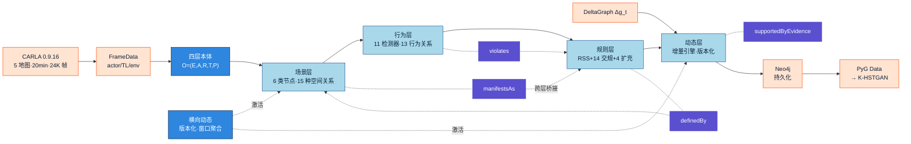
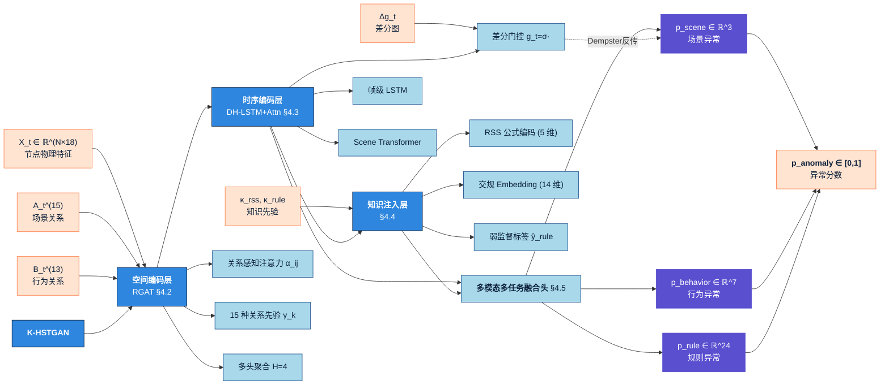
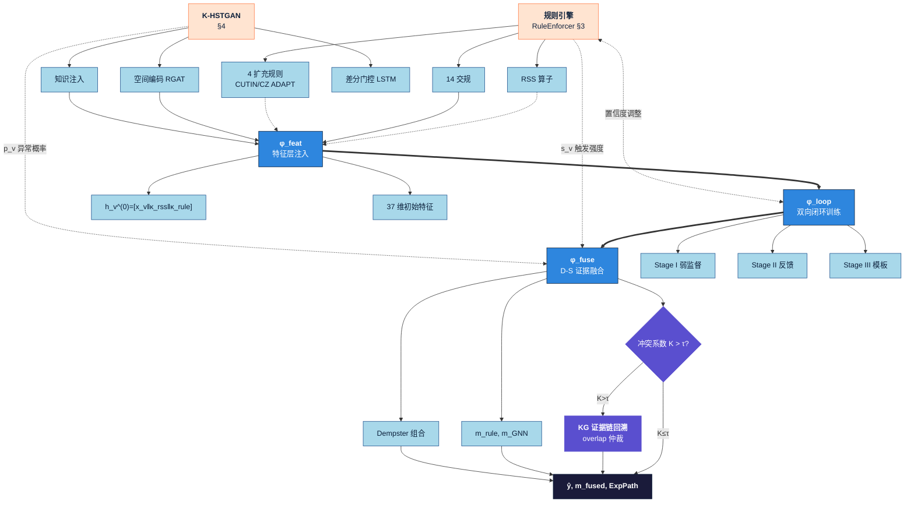
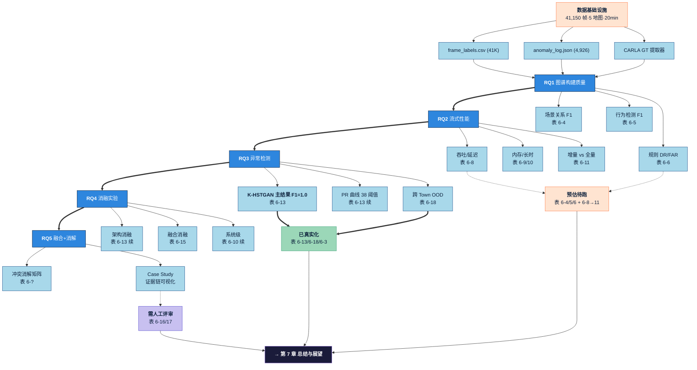

# 四大框架图 — 视觉预览（Mermaid 对照版）

> 仅为**布局预览**，正式论文图请使用同目录下的 `figs_framework.tex`（科技蓝渐变 + 光泽感 LaTeX TikZ 源码）。
> Mermaid 用于在设计阶段快速校对结构；论文正文插图请编译 `.tex` 文件。

---

## 图 1 — 创新点① STKG 四层本体构建框架（§3）



---

## 图 2 — 创新点② K-HSTGAN 三层时空图注意力网络（§4）



---

## 图 3 — 创新点③ KS-NBCF 符号-神经双向闭环融合（§5）



---

## 图 4 — 实验与结果验证框架 §6（RQ1→RQ5）



---

## 编译说明

```bash
cd docs/thesis/figures/
pdflatex -shell-escape figs_framework.tex
# 输出 figs_framework.pdf（含 4 个独立页）
# 若需分图：将每个 tikzpicture 块拆为独立 tex
```

## 在论文正文中引用示例

```latex
\begin{figure}[htbp]
  \centering
  \includegraphics[width=0.95\textwidth]{figures/fig_stkg_framework.pdf}
  \caption{STKG 四层本体构建框架}
  \label{fig:stkg_framework}
\end{figure}
```
